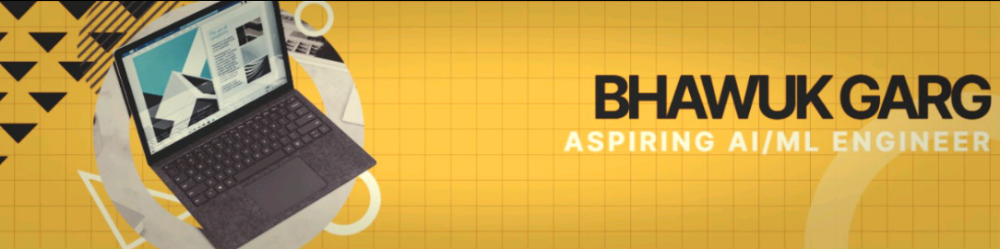

# README.md

# 👋 Hi, I'm Bhawuk Garg!

### 🎓 AI/ML Enthusiast | 🧠 Developer | 🎮 Gamer | 🎨 Designer

I'm a 3rd-year student at **Echelon Institute of Technology, Faridabad**, passionate about Artificial Intelligence, Machine Learning, and building smart tools that simplify life. Whether it’s designing a horror escape room in Roblox or developing a voice-controlled desktop assistant, I love exploring the edge of what’s possible with tech.

---

## 🧠 What I'm Learning

- 🔢 Machine Learning Algorithms (Logistic/Linear Regression)
- 🔐 Cybersecurity (Threat domains, Malware, APTs, etc.)
- 🧾 Data Cleaning & Visualization

---

## 🛠️ Tools & Tech

```python
Languages     = [ Python, C++, R, SQL, Java]
AI/ML         = [ scikit-learn, NumPy, Pandas,  ]
Dev Tools     = [ Git, VS Code, Jupyter Notebook ]
Creative Work = [ Adobe After Effects, premire pro, MS Office,   ]
